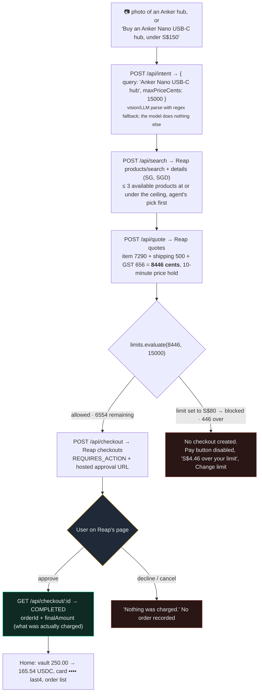
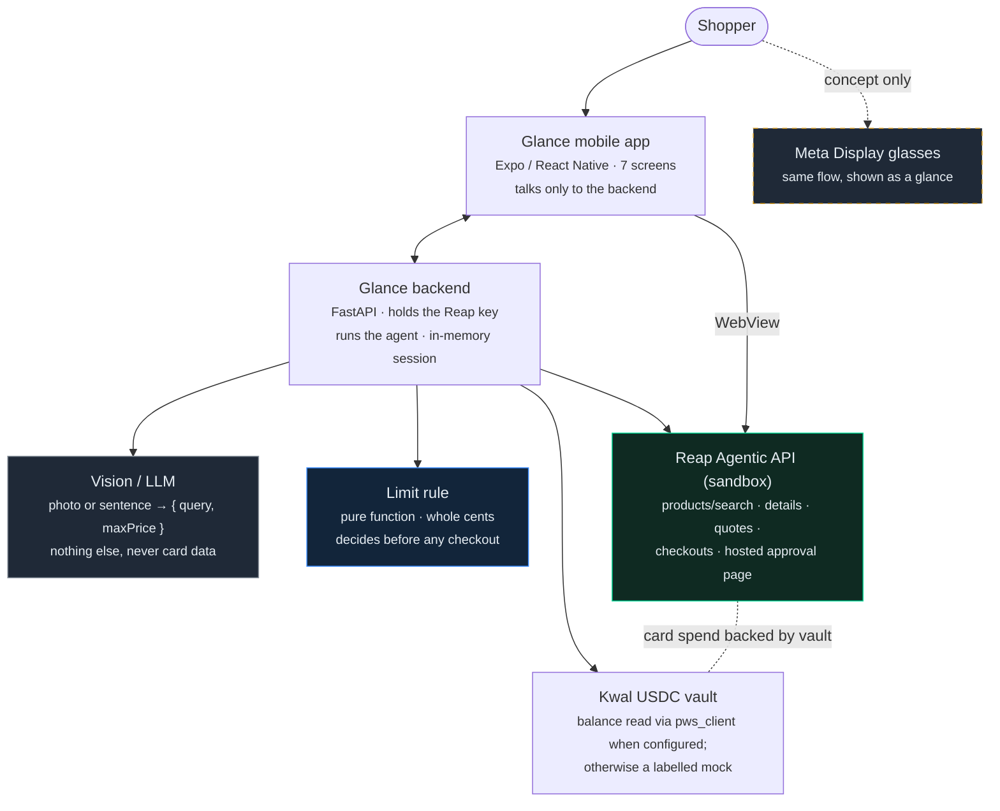
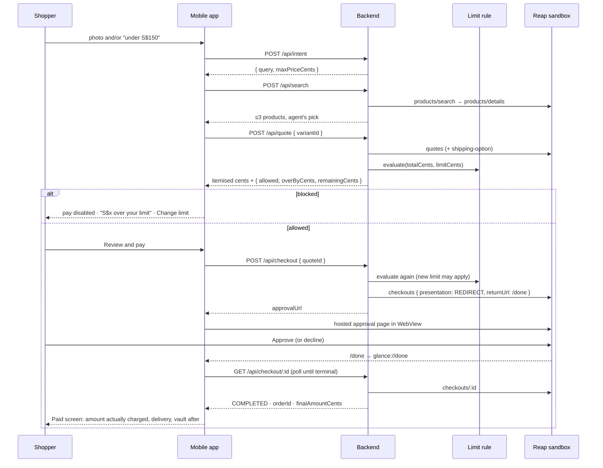

# Glance

**Look at a product through Meta Display glasses, or scan it with your phone camera, say "under S$150" — and an AI agent finds it, prices it in full, checks it against your spending limit, and pays through the Reap Agentic API with a card backed by your Kwal USDC vault. Never without you approving the charge yourself.**

Glance turns one glance, one photo, or one sentence into a priced, limit-checked purchase. A pure, unit-tested limit rule — not the model — decides whether a checkout may even be opened. The user approves every charge on Reap's own hosted page; the agent never sees a card number.

## What Glance uses

| | Role | Tonight |
|---|---|---|
| **Meta Display glasses** | Hands-free input: look at the product, say the limit, see the agent's progress and the price-vs-limit check as a HUD. Approval always happens on the phone | Concept — shown in the [product film](design/glance-product-film.html); no third-party HUD SDK yet |
| **Phone camera** | Scan the product with the Glance app; a vision model identifies brand and model from the photo. Or just type one sentence | Built — `expo-image-picker` → `POST /api/intent` with the image |
| **Reap Agentic API** | The purchase: `products/search` → `products/details` → `quotes` (+ shipping option) → `checkouts` → hosted approval page → order reference and final amount | Built — live against the Reap sandbox, Singapore / SGD |
| **Kwal (Payward) USDC vault** | The money: stablecoins in a wallet the user owns back the card that pays the merchant. The app shows the vault balance before and after each purchase | Built behind a flag — `backend/app/vault.py` reads the balance via Kwal's `pws_client` when `KWAL_SCRIPTS` + credentials are configured; otherwise a mock labelled as such |

Built in one evening at the **Reap × 65labs Agentic Buildathon**, Singapore, 9 October 2026. Sandbox only: nothing is really bought or shipped.

[](https://www.youtube.com/watch?v=vuL4Ya3pzrs)

> **Demo video (62 s, narrated):** [youtu.be/vuL4Ya3pzrs](https://youtu.be/vuL4Ya3pzrs) · silent master: [`design/glance-pitch-62s.mp4`](design/glance-pitch-62s.mp4) · **Interactive demo:** [`design/glance-app-mockup.html`](design/glance-app-mockup.html) (press **Play the pitch**; phone + Meta Display lens + live backend trace) · **Product film:** [`design/glance-product-film.html`](design/glance-product-film.html) · **Voice-over script:** [`design/pitch-voiceover.md`](design/pitch-voiceover.md)

---

## Summary

| | |
|---|---|
| **Demo video** | [youtube.com/watch?v=vuL4Ya3pzrs](https://www.youtube.com/watch?v=vuL4Ya3pzrs) |
| **What it is** | A mobile app where an agent shops for you inside a hard spending limit, and you approve every charge |
| **Problem solved** | "Agentic commerce" demos either let the model spend freely or make the human re-do the whole checkout. Glance keeps the agent useful (search, price, compare, pre-check) and the human in control (one approval tap on the provider's page), with a limit that is enforced in code before any checkout exists |
| **Two ways to see** | **Meta Display glasses** — hands-free, concept film; same agent, same rules, approval still on the phone. **Phone camera** — built: a photo goes to a vision model that identifies the product |
| **Two APIs** | **Reap Agentic API** for search, quotes, checkout and the hosted approval page. **Kwal** for the USDC vault that backs the card |
| **Track** | Best Bridge Between Onchain and Real World — stablecoins in a Kwal (Payward) vault back a card payment at a real merchant catalogue |
| **Core rule** | *Limit before checkout.* `limits.evaluate(total_cents, limit_cents)` is a pure function over whole cents, inclusive at the limit, with 8 unit tests. If it says blocked, no Reap checkout is created and the user is told by exactly how much |
| **Honest amounts** | Money is integer cents end to end; floats are never used. The Paid screen shows the amount Reap actually charged, never the quote |
| **Status** | Spec 001 (the whole product) through G1 and G2; backend, mobile app, happy-path script and AC traceability in place. Search, product details and quotes verified live against the Reap sandbox (SG/SGD). Checkout → approval → paid verified with Reap's simulated completion; the live hosted approval depends on the team card enrollment being `ACTIVE` |
| **Stack** | FastAPI + httpx (backend, in-memory session state), Expo / React Native + WebView (mobile), pytest (30 tests), Spec Kit for Devin (spec → clarify → plan → tasks → implement → traceability) |

## The problem

Give a shopping agent a card and a sentence, and one of two things happens. Either it is allowed to pay on its own — and then a mis-parsed "under 150" or a surprise shipping fee becomes your problem after the fact — or it stops at "here are some links" and you do the checkout yourself, which is no agent at all.

The gap is the *permission*: who decides that a specific total, with shipping and tax, is allowed to become a charge? In Glance that decision is never the model's. It belongs to two things the user controls:

1. **A per-purchase limit**, checked by a deterministic rule against the merchant's full itemised quote, *before* any checkout is opened. Over the limit → nothing is opened, and the user sees "S$4.46 over your limit", not a vague refusal.
2. **An approval tap on the payment provider's own page.** The app opens Reap's hosted approval page in a WebView and waits. Decline charges nothing. The app never recreates that page, never scrapes a merchant checkout, and never handles card details.

The money side is the bridge the track asks for: the card that pays the merchant is backed by USDC the user holds in a Kwal vault. Onchain funds, real-world merchant, one approval.

## A concrete example

The locked demo scenario, Singapore market, run against the Reap sandbox:



Two details matter more than they look. The limit is checked against the *quoted total*, not the item price — the thing that actually hits the card. And changing the delivery option re-quotes and re-evaluates; a cheaper shipping choice can bring an over-limit order back under.

## How it works



The rules we hold ourselves to live in [`.specify/memory/constitution.md`](.specify/memory/constitution.md); the ones that shape the code:

1. **User approves every charge** on the provider's own page. The app must not recreate, bypass, or automate it.
2. **The agent never touches card details.** No card numbers in the app, server, logs, or any model prompt. No merchant checkout scraping.
3. **Limit before checkout.** Over-limit totals are blocked before any checkout is opened, with the over-amount stated.
4. **Honest amounts.** Integer cents only; the user is shown what was actually charged.
5. **Sandbox only; secrets in env vars.** Test funds, test card, simulated fulfilment.
6. **Specification first.** No code without an approved spec; every acceptance criterion has an ID and a test (or a noted manual check).

### The purchase path, step by step



### What is real and what is simulated

Judges should be able to tell at a glance, so the app labels it too.

| Piece | Tonight | Label in the app |
|---|---|---|
| Product search, details, quotes | **Real** Reap sandbox calls, Singapore / SGD | — |
| Checkout, hosted approval, order reference | Real Reap sandbox checkout; completion may be simulated with Reap's `X-Simulate-Checkout: COMPLETED` when the hosted page is unavailable | "Sandbox: the checkout is simulated and nothing ships." |
| Spending limit | **Real**, our code — Reap mandates are not live in sandbox | — |
| Intent from a photo | **Real** vision model call (Anthropic or OpenAI key); regex fallback for text-only | "Looking at the photo" |
| USDC vault balance | Live Kwal read when `KWAL_SCRIPTS` + credentials are configured; otherwise a mock | "Mock balance (Kwal vault pending)" |
| Meta Display glasses | **Concept** animation only | "Concept · glasses view simulated" |
| Demo mode (`EXPO_PUBLIC_DEMO=1`) | No network at all: canned catalogue, simulated approval page, for recording when the sandbox is down | "simulated approval page (demo mode)" |

## Project structure

```text
glance/
├── backend/              FastAPI service
│   ├── app/
│   │   ├── main.py          /api/intent · search · quote · checkout · home · limit · /done
│   │   ├── limits.py        the pure limit rule (whole cents, inclusive)
│   │   ├── money.py         Decimal → cents, never floats
│   │   ├── intent.py        photo/sentence → { query, maxPrice }, regex fallback
│   │   ├── reap.py          Reap Agentic API client (Reap-Version, Idempotency-Key)
│   │   └── vault.py         Kwal balance via pws_client, or labelled mock
│   └── tests/            pytest — one test per acceptance criterion, named by AC id
├── mobile/               Expo app: Home · Ask (camera/text) · Results · Quote · Approve · Paid · Limit
│   └── src/api.demo.ts      offline demo adapter (EXPO_PUBLIC_DEMO=1)
├── scripts/happy_path.sh end-to-end by curl: intent → search → quote → checkout → paid
├── specs/001-agent-purchase/  spec, clarifications, plan, research, tasks, G1/G2, traceability
├── design/               interactive demo (glance-app-mockup.html: phone, Meta Display lens,
│                            backend trace, 62 s auto-pitch), product film, pitch video + voice-over
│                            script, headless recorder (record-pitch.mjs)
├── docs/                 context, scope lock, run sheet
└── .specify/             constitution and Spec Kit templates
```

## Spec-driven

One spec covers the whole product, because one polished happy path is the submission. It went spec → clarify → **G1** → plan → **G2** → tasks → implement → traceability, with a hard code-freeze clock in [`docs/scope-lock.md`](docs/scope-lock.md).

| Story | What it proves | ACs | Evidence |
|---|---|---|---|
| P1 Happy path | sentence/photo → ≤3 products → itemised quote → approval on Reap's page → order ref + amount charged | AC-001-01…06 | `test_api.py`, `scripts/happy_path.sh`, phone walk-through |
| P2 Limit blocks over-budget | blocked before checkout, over-amount stated, new limit applies to next quote | AC-001-07…10 | `test_limits.py` (8 tests), `test_api.py`, Quote screen |
| P3 Re-pricing, decline, home | delivery change re-quotes; decline charges nothing; home shows vault, card, limit, orders | AC-001-11…15 | `test_api.py`, manual checks |

Every acceptance criterion maps to a test whose name carries its ID, or a noted manual check: [`specs/001-agent-purchase/traceability.md`](specs/001-agent-purchase/traceability.md). Live sandbox observations (response shapes, placeholder merchant names, quote expiry) are recorded in [`research.md`](specs/001-agent-purchase/research.md) rather than assumed.

## Getting started

```bash
# backend
cp backend/.env.example .env            # fill REAP_API_KEY (team secret); optional LLM_API_KEY for photo intent
cd backend && poetry install && poetry run pytest -q
poetry run uvicorn app.main:app --port 8000
cloudflared tunnel --url http://localhost:8000   # Reap needs an HTTPS return URL → set PUBLIC_URL, restart

# enrol the team test card once (human step on Reap's hosted page)
curl -X POST $PUBLIC_URL/api/enroll -H 'content-type: application/json' -d '{}' | jq .nextAction.url
curl $PUBLIC_URL/api/enrollment | jq .status     # wait for ACTIVE

# end to end by curl
PUBLIC_URL=$PUBLIC_URL scripts/happy_path.sh

# phone (Expo Go, iOS simulator or device)
cd mobile && npm install
EXPO_PUBLIC_API_URL=$PUBLIC_URL npx expo start --ios

# offline demo mode: same app, canned data, no backend or Reap calls
npm run demo:ios
```

Secrets (`REAP_API_KEY`, test card, LLM key, Kwal credentials) live only in `.env` and the Kwal credentials file outside the repo — see `.gitignore`.

## Further reading

- Product and API context for the build: [`docs/context.md`](docs/context.md)
- What was in and out, and the timeline: [`docs/scope-lock.md`](docs/scope-lock.md)
- Governing principles: [`.specify/memory/constitution.md`](.specify/memory/constitution.md)
- The spec, with clarifications: [`specs/001-agent-purchase/spec.md`](specs/001-agent-purchase/spec.md)
- Plan and research, including live Reap observations: [`plan.md`](specs/001-agent-purchase/plan.md) · [`research.md`](specs/001-agent-purchase/research.md)
- Demo beats and voice-over, cue by cue: [`design/pitch-voiceover.md`](design/pitch-voiceover.md)
