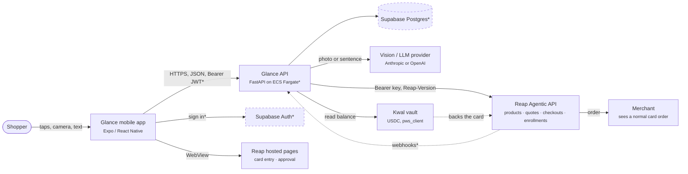
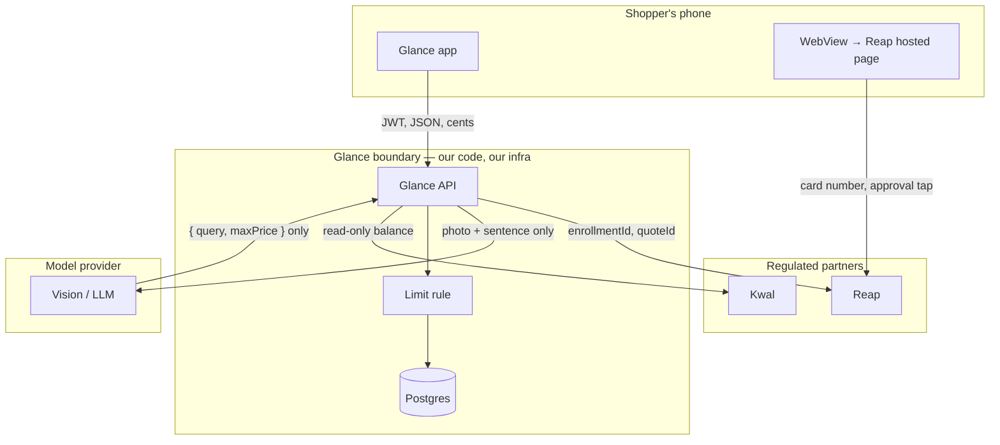
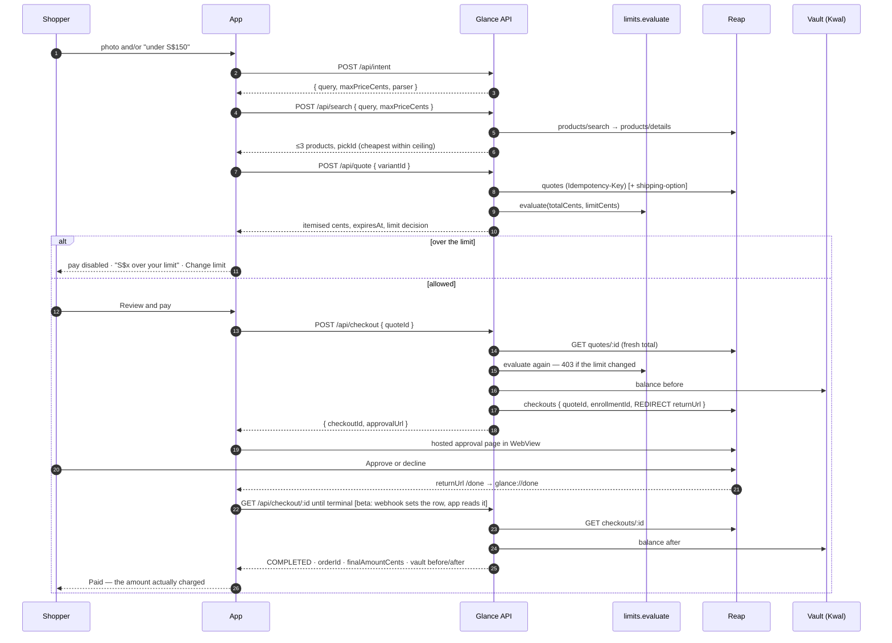
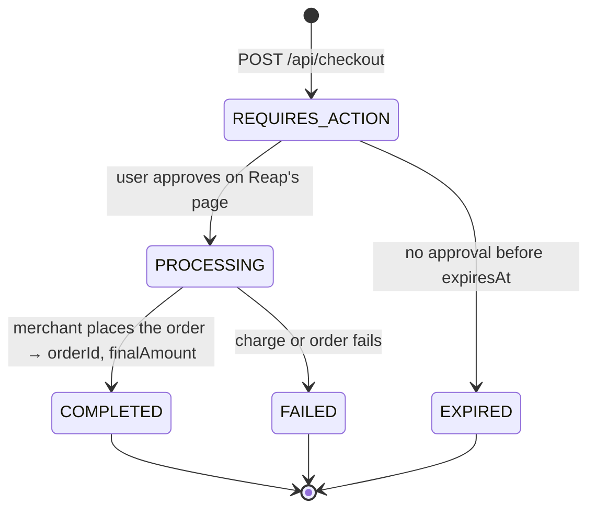
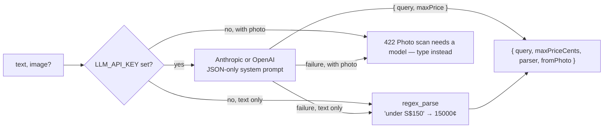

# Glance — technical architecture

How Glance is put together today, and how it is built out to a public beta. Every
section marks what is **Built** (in this repo, verified against the Reap sandbox) and
what is **Planned** (the beta build, decided in [delivery-plan.md](delivery-plan.md)).

Related: [infrastructure.md](infrastructure.md) · [persistence.md](persistence.md) ·
[api.md](api.md) · [security.md](security.md) · [mobile-release.md](mobile-release.md)

## 1. What the system has to guarantee

The product is a shopping agent that can *search, price and pre-check* but can never
*spend* on its own. Everything below exists to make five guarantees hold under load,
under retries and under a hostile prompt. They come from
[`.specify/memory/constitution.md`](../.specify/memory/constitution.md):

| # | Guarantee | Where it is enforced |
|---|---|---|
| G1 | The user approves every charge on the payment provider's own page | Reap hosted approval page, rendered in a WebView the app never scripts (`mobile/src/Approve.tsx`) |
| G2 | No card data ever enters Glance — app, API, logs or model prompts | Card entry and approval happen on Reap hosted pages; the API only ever holds an `enrollmentId` and `last4` |
| G3 | A per-purchase limit is checked **before** a checkout exists, and again when it is created | `backend/app/limits.py`, called from `POST /api/quote` and `POST /api/checkout` |
| G4 | Amounts are honest: integer cents end to end, and the receipt shows what was actually charged | `backend/app/money.py`; Paid screen reads `finalAmount` from `GET /agentic/checkouts/:id` |
| G5 | The model only turns a photo or a sentence into `{ query, maxPriceCents }` | `backend/app/intent.py`; its output can narrow a search but never raise a limit |

## 2. System context



`*` = planned for beta. Today the API keeps state in a JSON file, has no sign-in, and
polls Reap instead of receiving webhooks.

### Components and responsibilities

| Component | Responsibility | Status | Where |
|---|---|---|---|
| Mobile app | Seven screens (Home, Ask, Results, Quote, Approve, Paid, Limit); formats cents; opens the approval page; never calls Reap directly | Built | `mobile/App.tsx`, `mobile/src/` |
| Demo adapter | Same screens with canned data and a simulated approval page; no network (`EXPO_PUBLIC_DEMO=1`) | Built | `mobile/src/api.demo.ts` |
| Glance API | Owns the Reap key; runs the purchase flow; evaluates the limit; records orders | Built | `backend/app/main.py` |
| Intent parser | Photo and/or sentence → `{ query, maxPriceCents }` with a regex fallback; the only model call in the product | Built | `backend/app/intent.py` |
| Limit rule | `evaluate(total_cents, limit_cents)` → `LimitDecision`; pure, inclusive, 8 unit tests | Built | `backend/app/limits.py` |
| Money | Reap amount shapes → integer cents via `Decimal`; never floats | Built | `backend/app/money.py` |
| Reap client | Bearer + `Reap-Version` + `Idempotency-Key`; surfaces errors verbatim as `502 {error:"reap"}` | Built | `backend/app/reap.py` |
| Vault adapter | Kwal balance through `pws_client` when configured; otherwise a balance labelled `mock` | Built behind a flag | `backend/app/vault.py` |
| Return page | `/done` lands the WebView, posts a message and deep-links `glance://done` | Built | `main.py` |
| Session state | `limitCents`, quotes, checkouts, orders, enrollment id in `STATE_FILE` | Built (JSON file) → Postgres | [persistence.md](persistence.md) |
| Accounts | Sign in with Apple / Google / email; one shopper per session today | Planned | [security.md](security.md) §4 |
| Webhook receiver | Reap event intake with HMAC verification; replaces client polling as the source of completion | Planned | [api.md](api.md) §4 |
| Reconciliation job | Re-reads non-final checkouts until they are `COMPLETED`, `FAILED` or `EXPIRED` | Planned | [persistence.md](persistence.md) §4 |

## 3. Trust boundaries



What crosses each boundary, and what never does:

- **Phone → Glance API**: intent text, a JPEG, product/quote/checkout ids, the limit in
  cents, a JWT. Never a card number — the app has no field for one.
- **Phone → Reap** (WebView): the card number at enrollment and the approval tap. The app
  only watches navigation for the return URL; it does not inject scripts or read the page.
- **Glance API → Reap**: search queries, variant ids, a quote id, an `enrollmentId`, a
  return URL. The Reap API key stays in the API's environment.
- **Glance API → model**: the photo and the sentence, with a system prompt that forbids
  reading card numbers. The reply is parsed into exactly two fields; anything else is
  discarded and the regex fallback is used.
- **Glance API → Kwal**: today a read of the vault's available balance.

## 4. The purchase flow

Built today, verified against the Reap sandbox (SG/SGD). Items in brackets are what
changes at beta.



Design points that are easy to miss:

1. **The limit is evaluated against the quoted total** (item + shipping + tax), not the
   item price, because that is what reaches the card. Changing delivery re-quotes and
   re-evaluates.
2. **`POST /api/checkout` re-reads the quote and re-evaluates.** A limit lowered between
   the Quote and Approve screens blocks the checkout with `403 { overByCents }`; an
   expired quote is refused with `410` so a stale price is never charged.
3. **Landing on the return URL does not mean the order is placed.** Reap's lifecycle is
   `REQUIRES_ACTION → PROCESSING → COMPLETED | FAILED`, or `EXPIRED` if the user never
   approves. The app treats `/done` only as a cue to read the status.
4. **The receipt shows `finalAmount`**, never the quote total.

### Checkout states as Glance sees them



`COMPLETED`, `FAILED` and `EXPIRED` are final; the app branches on the value rather than
treating "not completed" as "still running". Decline on the hosted page shows as the
checkout never leaving `REQUIRES_ACTION` until it expires — the app's decline path
("Nothing was charged") records no order. The current code's terminal set also lists
`CANCELED`/`DECLINED` defensively; they are not in Reap's published lifecycle.

## 5. Intent: the one model call



The ceiling the model extracts is a *search filter*. The user's limit is a separate
number the model never sees as something it can change; the limit rule runs on the
merchant's quote regardless of what the model said. A prompt injected through a photo
can at worst produce a bad search query.

Beta hardening ([security.md](security.md) §8): schema-validate the model reply,
cap image size and resize on device, scrub anything that looks like a PAN from the reply,
and record `parser` so we can see how often the fallback is used.

## 6. Money

- Reap returns amounts as JSON numbers (`{"amount": 35.99, "currency": "SGD"}`) and
  sometimes nests them (`tax.amount.amount`). `money.to_cents` accepts strings, numbers
  and both nestings, parses through `Decimal`, rejects more than two decimals, and
  returns an `int`.
- Every API field carrying money ends in `Cents`; the app formats `S$` + cents/100 and
  never does arithmetic on floats.
- One currency per session (`SHOP_CURRENCY`, SGD). Multi-currency is out of beta scope.

## 7. Mobile app

**Built:** a single state machine in `App.tsx` (`home | ask | results | quote | approve |
paid | limit`), a typed client in `src/api.ts` whose shapes mirror the backend, a WebView
approval component that fires once when navigation hits `${API_URL}/done` or
`glance://`, and the demo adapter. Expo SDK 57; WebView, image picker and slider are
bundled in Expo Go, so no dev build was needed for the hackathon.

**Planned** ([mobile-release.md](mobile-release.md)):

- Expo Router with routes in `src/app/` and components outside it (as
  [`mobile/AGENTS.md`](../mobile/AGENTS.md) prescribes), one file per current screen.
- `expo-dev-client` builds via EAS; three channels (development, preview, production);
  `EXPO_PUBLIC_API_URL` per profile — the only public config, it holds no secret.
- Supabase Auth SDK for sign-in; the access token goes to the API as a Bearer header.
- Universal links for the return URL (`https://api.<domain>/done`) alongside the
  `glance://` scheme, so the hosted page returns cleanly on both platforms.
- Sentry for crashes, Maestro smoke test in demo mode.

## 8. Backend layout: now and at beta

```text
backend/app/                     today                      beta (additive)
├── main.py                      all endpoints              thin: app factory, routers, middleware
├── api/                                                    routers: intent, search, quote, checkout, home, limit, enroll, webhooks, account
├── domain/
│   ├── limits.py                pure rule (moves here)     unchanged
│   ├── money.py                 cents (moves here)         unchanged
│   └── checkout_state.py                                   Reap status → Glance mapping, reconciliation rules
├── adapters/
│   ├── reap.py                  httpx client               + retries on 5xx/timeouts for idempotent calls, metrics
│   ├── intent.py                vision/LLM + regex         + schema validation, PAN scrub, size caps
│   └── vault.py                 Kwal read or mock          + per-user credentials, provisioning status
├── auth.py                                                 Supabase JWT verification → current user
├── db/                                                     SQLAlchemy models, repositories, Alembic migrations
└── settings.py                                             typed settings; no load_dotenv in production images
```

The purchase endpoints keep their paths and shapes ([api.md](api.md)); the mobile app
only gains an `Authorization` header.

## 9. Hackathon build → public beta

| Dimension | Today | Beta | Detail |
|---|---|---|---|
| Hosting | `uvicorn` on a laptop behind a `cloudflared` tunnel | ECS Fargate in `ap-southeast-1` behind an ALB, Terraform | [infrastructure.md](infrastructure.md) |
| State | JSON file (`STATE_FILE`) | Supabase Postgres, Alembic migrations | [persistence.md](persistence.md) |
| Identity | None; one shopper | Supabase Auth, per-user rows and RLS | [security.md](security.md) §4 |
| Card enrollment | One team test card, `REAP_ENROLLMENT_ID` in env | Per-user `EXTERNAL` enrollment on Reap's hosted page; revoke; `REAP_CARD`/`BIN_SPONSOR` when Reap ships them | [delivery-plan.md](delivery-plan.md) Phase 2 |
| Shipping address | Env vars | Per-user address, entered once in the app | [persistence.md](persistence.md) §2 |
| Completion | App polls `GET /api/checkout/:id` | Reap webhook → row update; app reads; polling kept as fallback; reconciliation job | [api.md](api.md) §4 |
| Vault | Balance read from one Kwal session, or mock | Kwal vault per user; card from the vault enrolled in Reap | [delivery-plan.md](delivery-plan.md) Phase 3 |
| Reap environment | Sandbox, `X-Simulate-Checkout: COMPLETED` | Production key and base URL from Reap; simulate header removed; Visa/Reap production approval | [infrastructure.md](infrastructure.md) §12 |
| Idempotency | Random UUID per Reap POST | Key derived from our row id; stored, so retries are safe | [api.md](api.md) §5 |
| Observability | `print` | Structured logs, metrics, alarms, Sentry | [infrastructure.md](infrastructure.md) §9 |
| Tests | 30 pytest + `tsc` + curl script | + contract tests against sandbox nightly, Maestro smoke, load test of quote/checkout | [delivery-plan.md](delivery-plan.md) |
| Distribution | Expo Go | EAS Build → TestFlight / Play testing; EAS Update for JS | [mobile-release.md](mobile-release.md) |

## 10. Decisions

| Decision | Choice | Why | Revisit when |
|---|---|---|---|
| Backend framework | Keep FastAPI + httpx (Python 3.12) | Already built and tested; async fits the Reap-bound latency profile | Never for beta |
| Compute | AWS ECS Fargate, `ap-southeast-1` | Containers without node management; Singapore region next to Reap; standard IAM/VPC controls | If traffic justifies EKS or if cost demands a PaaS |
| Database and auth | Supabase (Postgres + Auth), Singapore region | One managed service for data, sign-in and RLS; Apple/Google sign-in out of the box | If we need RDS-only compliance posture: `pg_dump` → RDS, swap `DATABASE_URL` |
| Completion signal | Webhooks when Reap enables them for agentic checkouts; polling + reconciliation until then | Reap's own guidance is to read the checkout after the return URL; webhooks remove the client-side poll loop | When Reap publishes the agentic event set |
| Spending limit | Our own rule, server-side | Reap mandates are not live in sandbox or production | When mandates ship: mandate as a second, provider-side ceiling |
| Mobile | Expo + EAS, Expo Router | Already Expo; EAS gives signed builds, OTA and store submission without local Xcode | — |
| Model provider | Pluggable (Anthropic or OpenAI by key prefix), small vision model | Only one narrow call; cheapest adequate model | If photo recognition accuracy is the bottleneck |
| Session currency | SGD only | Market and Reap key are Singapore | Multi-market |
