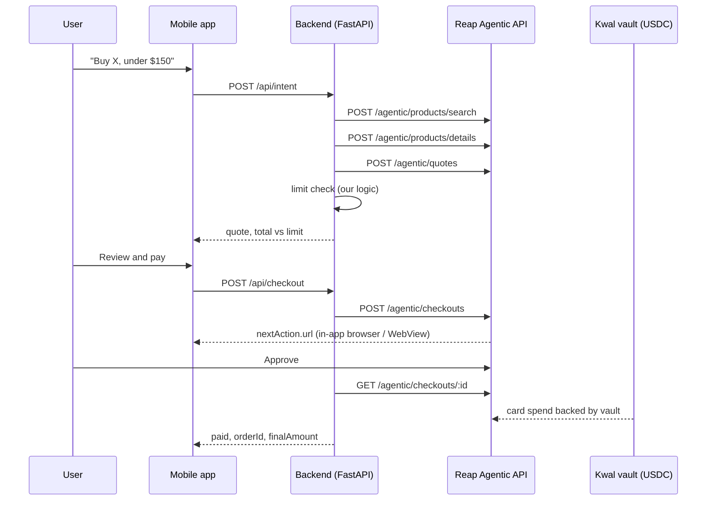

# Glance: handoff context

## What we are building
Glance is a mobile app where an AI agent finds a product, prices it, checks it
against the user's spending limit, and pays for it with a card backed by the
user's USDC vault. The user approves every charge.

Event: Reap x 65labs Agentic Buildathon, Singapore, Fri 9 Oct 2026.
Hard deadline: project submission 9:00 pm SGT. Code freeze 8:00 pm.
Target prize track: "Best Bridge Between Onchain and Real World"
(fallback: "Most Worthwhile Problem" if the Kwal vault is not ready).
Judging is on the submission after the event, so one polished happy path and
a demo video matter more than breadth.

## Hackathon rules that constrain the build
- Must use Reap's Agentic module, Kwal (Payward), or both. Sandbox only.
- Checkout is simulated. No real purchases or deliveries.
- Never scrape a merchant checkout. Never pass raw card details to an LLM.
- Travel booking, gambling and adult content are out of scope.
- Reap API key and test card are secrets: env vars only, never commit them.

## Architecture
- Frontend: React Native mobile app (Expo) implementing the screens, copy and
  styles of design/glance-app-mockup.html. Talks only to our backend.
- Backend (Python, FastAPI): holds the Reap API key, runs the agent, calls
  Reap. Must be deployed on HTTPS early, because Reap's hosted pages need an
  HTTPS return URL.
- LLM: parses the user's sentence into { query, maxPrice }. Nothing else.
- Meta Display glasses: NOT in scope for code. Covered by a concept film
  (design/glance-product-film.html).

## Reap API facts (from docs.reap.global)
- Base URL: https://sandbox.api.reap.global
- Every request: `Authorization: Bearer $REAP_API_KEY` and `Reap-Version: <date>`.
  Requests without Reap-Version are rejected. Docs example value is
  2025-02-14; CONFIRM the value for our key.
- `Idempotency-Key` header required on POST /agentic/enrollments,
  /agentic/quotes and /agentic/checkouts.
- One-time setup: POST /agentic/enrollments with source EXTERNAL, owner
  { type: CLIENT_REFERENCE, id, email }, presentation { type: REDIRECT,
  returnUrl }. Open nextAction.url, enter the team test card, then poll
  GET /agentic/enrollments/:id until status is ACTIVE. OTP if asked: 456789.
- Purchase sequence:
  1. POST /agentic/products/search  { query, context{country,currency},
     filters{price{max}, availability: AVAILABLE_ONLY} }
  2. POST /agentic/products/details { productIds } -> defaultVariant.id
     (POST /agentic/products/variant only if the user picks options)
  3. POST /agentic/quotes { items:[{variantId, quantity}], email,
     shippingAddress if requiresShipping } -> amountBreakdown.finalAmount,
     shippingOptions, expiresAt
  4. POST /agentic/quotes/:id/shipping-option { shippingOptionId }
  5. POST /agentic/checkouts { quoteId, enrollmentId, presentation{type:
     REDIRECT, returnUrl} } -> status REQUIRES_ACTION, nextAction.url
     Sandbox: header `X-Simulate-Checkout: COMPLETED` simulates completion.
  6. GET /agentic/checkouts/:id until terminal -> orderId, finalAmount
- Mandates are NOT live, even in sandbox. The spending limit is our own code.
- Only an ACTIVE enrollment can be charged. Quotes expire; check expiresAt.
- Full reference: https://docs.reap.global/llms.txt and
  https://docs.reap.global/agentic-payments/one-time-purchases.md

## Kwal facts (github.com/payward/kwal-skill, skills/agent-payment)
- Python 3.10+, Linux or macOS. Scripts: `python3 scripts/register.py
  check | register | setup | status | show | call <route>`.
- Importable client: add scripts/ to sys.path and import `pws_client`.
  Read the repo for its real function names; do not guess them.
- Needs an owner EVM wallet on Ink Sepolia (chain ID 763373) with test ETH
  and test USDC from faucets. A human does the wallet funding.
- `register` is NOT idempotent and there is no renewal. Never re-register to
  fix a stuck setup; that creates a new identity and loses the vault.
- Credentials file must live outside any git checkout.
- Vault provisioning can queue for minutes. If the vault is not ready, build
  Reap-only and keep the vault balance as a clearly labelled sample.

## Screens (open design/glance-app-mockup.html in a browser)
1. Home: USDC vault balance, card last4, per-purchase limit, order list.
2. Ask: one text box, three progress lines while the agent works.
3. Results: up to 3 products, agent's pick preselected.
4. Quote: item, shipping options, breakdown, total vs limit meter.
   If total > limit: show the amount over, disable checkout.
5. Approve: Reap's hosted approval page. Do not rebuild this page.
6. Paid: orderId, finalAmount, vault balance after.
7. Spending limit: one slider, default $150.

## Backend endpoints to implement
- POST /api/intent    { text } -> { query, maxPrice }
- POST /api/search    { query, maxPrice } -> products
- POST /api/quote     { variantId, shippingOptionId? } -> quote + overLimit
- POST /api/checkout  { quoteId } -> { checkoutId, approvalUrl }
- GET  /api/checkout/:id -> { status, orderId, finalAmount }
- GET  /api/home      -> { vaultBalance, cardLast4, limit, orders }
- PUT  /api/limit     { perPurchase }
- GET  /done          -> return-URL landing that sends the user to Paid

## Demo data used in the mockup (sample, not verified against the sandbox)
Sony WH-1000XM5, $129 item + $5 shipping + $5 tax = $134, limit $150,
vault 250.00 USDC -> 116.00. Check the real product against Reap's
supported merchant sheet before relying on it.

## Working agreement
- Verify each Reap call with curl before wiring the UI to it.
- If a Reap call fails, show me the exact request and response; do not
  work around it with mocks unless I say so.
- Ask before changing the architecture or adding dependencies.
