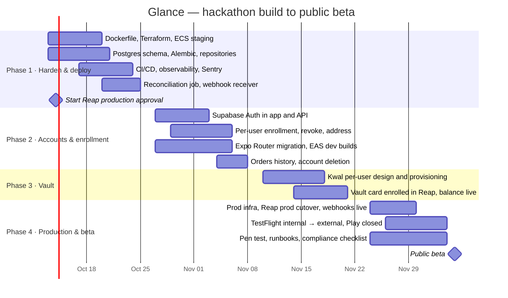

# Glance — delivery plan to public beta

From the hackathon build (one shopper, one laptop, Reap sandbox) to a public beta on
TestFlight and Google Play against Reap production, for a few hundred Singapore users.
Four phases, each with an exit gate in the spirit of the G1/G2/G3 gates used so far.
Dates are relative; the plan assumes a two-person team (one backend/infra, one mobile)
plus product.

Related: [architecture.md](architecture.md) §9 · [infrastructure.md](infrastructure.md) ·
[persistence.md](persistence.md) · [api.md](api.md) · [security.md](security.md) ·
[mobile-release.md](mobile-release.md)

## 0. Where we start (done — 9 Oct 2026)

- FastAPI backend with the full purchase path verified live against the Reap sandbox
  (SG/SGD): search, details, quotes, shipping option, checkout, hosted approval, status.
- Pure limit rule and integer-cents money with 30 tests; one test per acceptance criterion
  ([`specs/001-agent-purchase/traceability.md`](../specs/001-agent-purchase/traceability.md)).
- Expo app with seven screens, WebView approval, photo intent, offline demo mode.
- Kwal balance read behind a flag; Meta Display glasses as a concept film.
- Interactive demo, product film, pitch video, App Store screenshot kit.

## 1. Timeline

## 2. Phases

### Phase 1 — Harden and deploy (weeks 1–2)

Make the existing backend a service: containerised, in Singapore, with real persistence
and real monitoring. No new product behaviour.

| Deliverable | Detail |
|---|---|
| Container + Terraform | `Dockerfile`, `infra/terraform` modules and `dev`/`staging` envs; ECS Fargate service behind ALB with ACM; WAF; Secrets Manager ([infrastructure.md](infrastructure.md) §4–8) |
| Persistence | Supabase `dev`/`staging` projects; first Alembic migration with the schema in [persistence.md](persistence.md) §2 (single test user for now); `main.py` reads/writes repositories instead of `STATE_FILE` |
| Backend layout | Split `main.py` into routers/domain/adapters ([architecture.md](architecture.md) §8); typed settings; no `load_dotenv` in the image |
| Completion | Reconciliation scheduled task; `POST /api/webhooks/reap` with HMAC verification (dark until Reap enables agentic events); checkout transitions monotonic |
| Idempotency | Stored keys for quotes/checkouts; Reap client retries only with the same key |
| CI/CD | GitHub Actions: PR checks, image build, staging deploy, smoke (`/health` + `scripts/happy_path.sh`), nightly sandbox contract test |
| Observability | JSON logs, metrics, alarms → Slack, Sentry; dashboard |
| Reap | **Open the production approval conversation now** (Visa + Reap review for agent builds takes time); confirm merchant coverage for SG electronics |

**Exit gate P1:** the happy-path script passes against `staging` from CI three nights
running; a deploy and a rollback have each been exercised; `vault_source=mock` alarm fires
in a test; no `print` left in the backend.

### Phase 2 — Accounts and enrollment (weeks 3–4)

Many shoppers, each with their own card, address and limit.

| Deliverable | Detail |
|---|---|
| Sign-in | Supabase Auth (Apple, Google, email OTP) in the app; JWT dependency in FastAPI; every row scoped by `user_id`; RLS policies ([security.md](security.md) §4) |
| Enrollment | Per-user `EXTERNAL` enrollment on Reap's hosted page from a new Cards screen; `owner.id` = user id; revoke; `last4`/`network` shown from the enrollment object |
| Address | `GET/PUT /api/address` and an Address screen; quotes use the shopper's address |
| Limit | Per-user `user_settings`; audit row per change; step-up for large raises |
| Orders | `GET /api/orders` paged; Home shows the latest 20 |
| Account deletion | `DELETE /api/account` and the in-app path |
| Mobile | Expo Router migration; `app.config.ts` + `eas.json`; development and preview builds; Sentry RN; Maestro smoke in demo mode |

**Exit gate P2:** two different test users complete a purchase on `staging` with two
different stored cards and addresses; one user cannot read the other's orders (tested);
TestFlight internal build installed by the whole team.

### Phase 3 — Vault (weeks 5–6)

Make the "onchain funds pay a real merchant" story true per user.

| Deliverable | Detail |
|---|---|
| Design decision | One Kwal participant per user vs. one program participant with per-user sub-balances — decided with Payward on production availability, KYC and custody terms |
| Provisioning | Vault status endpoint (`provisioning / ready / unavailable`); provisioning is a human-approved step until Kwal offers an idempotent API |
| Card | The Kwal-issued card is enrolled in Reap as an `EXTERNAL` card by the user on the hosted page (or via `BIN_SPONSOR`/`REAP_CARD` if Reap ships them in time) |
| Balance | Live read with `pws_client`, per-user credentials from Secrets Manager; "balance unavailable" instead of a mock in prod |
| Top-ups | Instructions screen (deposit address / supported assets per Kwal); no write-side vault operations in beta |

**Exit gate P3:** a sandbox purchase on `staging` debits a per-user Kwal vault balance that
the Home screen shows before and after; the mock path is unreachable in `prod` config.

### Phase 4 — Production cutover and public beta (weeks 7–8)

| Deliverable | Detail |
|---|---|
| Prod infra | `glance-prod` account applied from Terraform; Supabase `prod`; secrets loaded; `REAP_SIMULATE_CHECKOUT` absent |
| Reap production | Production key and base URL; `Reap-Version` pinned; webhook endpoint registered; one supervised real-money purchase with a S$20 limit as the acceptance test |
| Stores | Production build via EAS; TestFlight external beta (Apple review with sandbox reviewer account); Play closed testing; store listing from the App Store kit; privacy labels |
| Security | Pen test against `staging`; fixes; compliance checklist in [security.md](security.md) §12 all ticked |
| Operations | Runbooks written; alarms routed to a human; status page; support inbox |
| Launch | Invite list (a few hundred), feedback channel, weekly OTA cadence |

**Exit gate P4 (public beta):** 50 external testers complete at least one purchase;
crash-free sessions ≥ 99.5 %; zero orders shown as paid without `COMPLETED`; limit-block
accuracy 100 % in production logs.

## 3. Workstreams across phases

| Workstream | Owner | Phase 1 | Phase 2 | Phase 3 | Phase 4 |
|---|---|---|---|---|---|
| Backend | eng A | routers, DB, idempotency, reconciliation | auth, enrollment, address, orders | vault adapter | prod hardening |
| Infra / DevOps | eng A | Terraform, ECS, CI/CD, observability | OIDC roles, staging data | secrets for Kwal | prod account, pen-test fixes |
| Mobile | eng B | — (demo-mode Maestro) | Router, auth, Cards/Address screens, EAS | Vault screen | store release, OTA cadence |
| Partners | product | Reap prod approval start, merchant coverage | — | Payward terms, provisioning | Reap cutover, webhook go-live |
| Compliance / legal | product | — | privacy policy draft | custody wording | checklist complete |

## 4. Beta service levels

| Indicator | Target | Measured by |
|---|---|---|
| Purchase journey (intent → Paid) | p50 < 90 s, p95 < 3 min (SC-001) | app timing events |
| API latency excluding Reap time | p95 < 300 ms | ALB + API metrics |
| Availability of `POST /api/checkout` | 99.5 % monthly | ALB 5xx, synthetic check |
| Limit correctness | 100 % — no checkout created when `allowed=false` | audit log vs Reap checkouts, nightly job |
| Receipt honesty | 100 % — Paid shows `finalAmount` | code path + contract test |
| Crash-free sessions | ≥ 99.5 % | Sentry |
| Photo intent success | ≥ 85 % of photo attempts produce a usable query | `parser`/`fromPhoto` metrics |

## 5. Risks and mitigations

| Risk | Likelihood | Impact | Mitigation |
|---|---|---|---|
| Reap production approval (Visa + Reap) slips | Medium | Blocks Phase 4 | Start in week 1; keep beta on sandbox with a clearly labelled "simulated" badge as the fallback for an internal beta |
| Agentic webhooks not yet available | Medium | Polling remains | Reconciliation job is the primary completion path until events exist; app read is unchanged |
| SG merchant coverage thin or placeholder names persist | Medium | Weak demo, confused users | Confirm live merchants with Reap; show "Merchant via Reap" when the name is missing; curate a launch catalogue of known-good queries |
| Kwal per-user vault model unclear or not production-ready | High | Phase 3 slips | Phase 3 is isolated; beta can launch with user-enrolled external cards and the vault as "coming soon"; never fake a balance in prod |
| Hosted approval page UX inside a WebView | Low | Drop-off at approval | Universal links for return; Cancel always visible; Reap's own page is the control we keep |
| Apple review friction (purchases outside IAP, sign-in rules) | Low–Medium | Delays beta | Review notes + sandbox reviewer account; Sign in with Apple; account deletion done early |
| Model cost or latency on photo intent | Low | Slower Ask step | Small vision model, image resized on device, regex fallback; feature flag in `/api/config` |
| Idempotency gaps causing double checkouts | Low | Money | Stored keys and same-key-only retries (Phase 1), app-side key per tap |

## 6. Open questions to close with partners

| # | Question | Owner | Needed by |
|---|---|---|---|
| Q1 | Reap production base URL, key issuance, and the approval steps for an agent build (Visa review) | product ↔ Reap | P1 |
| Q2 | Which agentic events Reap's webhooks deliver (checkout status, enrollment status) and when | eng A ↔ Reap | P1 |
| Q3 | Timeline for `REAP_CARD` / `BIN_SPONSOR` enrollments and for mandates | product ↔ Reap | P3 |
| Q4 | Kwal: production gateway, per-user participant model, KYC requirements, custody and fee terms, credential renewal | product ↔ Payward | P3 |
| Q5 | Reap's expectations of partners under the redirect model for PCI attestation | product ↔ Reap | P4 |
| Q6 | Confirmed list of live SG merchants and categories for launch | product ↔ Reap | P2 |

## 7. Out of scope for the beta

Multi-currency and non-SG markets; variant selection beyond `defaultVariant`; recurring
purchases and mandates; vault write operations (withdrawals, transfers); Meta Display
glasses beyond the concept film; a web client; admin console. Each becomes its own spec
under `specs/` when it is picked up, per the constitution's specification-first rule.
