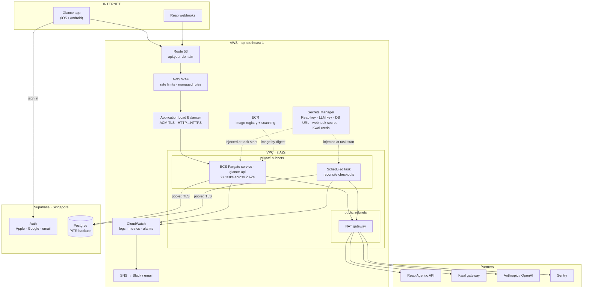
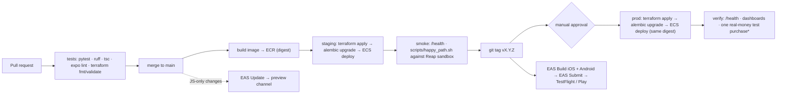

# Glance — infrastructure plan

Target: a public beta of the Glance API on **AWS ECS Fargate in `ap-southeast-1`
(Singapore)**, with **Supabase (Singapore)** for Postgres and sign-in, everything
described in Terraform and deployed from GitHub Actions. Status today: the backend runs
with `uvicorn` on a laptop behind a `cloudflared` tunnel (`docs/scope-lock.md`); nothing
in this document is provisioned yet unless marked.

Related: [architecture.md](architecture.md) · [persistence.md](persistence.md) ·
[security.md](security.md) · [delivery-plan.md](delivery-plan.md)

## 1. Principles

1. **Singapore first.** Reap's API and the shopper are in Singapore; every component sits
   in `ap-southeast-1` / Supabase "Southeast Asia (Singapore)" to keep the Reap-bound
   latency floor low.
2. **No card data, small compliance surface.** Card entry and approval happen on Reap's
   hosted pages. The infrastructure never stores, transits or logs a PAN, which keeps our
   PCI DSS posture to the redirect model ([security.md](security.md) §2).
3. **Fail closed on money.** If Reap, the database or the limit rule is unavailable, no
   checkout is created. Search can degrade; payment cannot.
4. **Everything as code.** Terraform for AWS, SQL migrations for the schema, `eas.json`
   for the app, GitHub Actions for delivery. No console changes in prod.
5. **One container, scaled horizontally.** The API is stateless once state lives in
   Postgres; two tasks across two AZs is the floor.

## 2. Target topology



## 3. Accounts, environments, regions

| Environment | AWS account | Reap | Supabase project | App channel | Who uses it |
|---|---|---|---|---|---|
| `dev` | `glance-dev` | sandbox key | `glance-dev` | development (dev client) | engineers, feature branches |
| `staging` | `glance-staging` | sandbox key | `glance-staging` | preview (TestFlight internal) | team, demo, Reap verification |
| `prod` | `glance-prod` | **production** key and base URL from Reap | `glance-prod` | production (TestFlight external beta / Play closed testing) | beta users |

- One AWS Organization, three member accounts, SSO for humans, OIDC for CI. Separate
  accounts (not just tags) so a staging mistake cannot touch production secrets or data.
- Terraform state per account in S3 with DynamoDB locking.
- `dev` may scale to one task and be stopped overnight; `staging` and `prod` are always on.

## 4. Compute: the API service

| Item | Setting | Note |
|---|---|---|
| Image | `python:3.12-slim`, non-root user, `uvicorn app.main:app --workers 2 --port 8000` | Poetry export → `pip install` in a multi-stage build; no `.env` in the image |
| Task size | 0.5 vCPU / 1 GB (beta) | The API is I/O bound on Reap; raise memory only if image uploads need it |
| Service | 2 tasks minimum, one per AZ; target tracking on CPU 60 % and ALB requests per target | Max 6 tasks for beta |
| Health | `GET /health` every 15 s; ECS deployment circuit breaker with automatic rollback | `/health` reports presence of the Reap key and an enrollment, never values |
| Deploy | Rolling, `minimumHealthyPercent 100`, `maximumPercent 200` | Zero-downtime; `/done` return pages keep working during a deploy |
| Timeouts | ALB idle 120 s; `httpx` to Reap 60 s (as today) | Quote and checkout calls are the slow ones |
| Scheduled task | `reconcile-checkouts` every 5 min (EventBridge → ECS RunTask) | Re-reads non-final checkouts ([persistence.md](persistence.md) §4) |

Image build happens in CI, is scanned in ECR on push, and is referenced by digest in the
task definition. The same digest is promoted `staging → prod`; prod is never rebuilt.

## 5. Network

- VPC `10.20.0.0/16`, two AZs, public subnets for the ALB and NAT gateway, private
  subnets for Fargate tasks and the scheduled task.
- Security groups: ALB accepts `443` from the internet (`80` only to redirect); tasks
  accept `8000` from the ALB security group only; tasks egress through the NAT gateway.
- Partners are reached over the public internet with TLS; Supabase over its pooler
  endpoint with TLS (`sslmode=require`). Reap publishes no fixed egress IP requirement for
  API calls; if Reap needs an allowlist for webhook *delivery*, the ALB is the target.
- One NAT gateway in beta (cost); two when the beta ends.

## 6. Edge and DNS

- Route 53 hosted zone for the API domain; `api.<domain>` → ALB alias. ACM certificate
  with DNS validation, auto-renewed.
- ALB: HTTPS listener (TLS 1.2+ policy), HTTP → HTTPS redirect, access logs to S3 (30 days).
- AWS WAF on the ALB: rate-based rule (e.g. 300 requests / 5 min / IP), AWS managed
  common rule set, body size limit for `/api/intent` consistent with the image cap.
- `PUBLIC_URL=https://api.<domain>` is what the API gives Reap as `returnUrl`; the
  `/done` page lives on the same host, and the app's universal link points at it.

## 7. Data: Supabase

| Item | Setting |
|---|---|
| Plan | Pro (daily backups + PITR, no pausing, compute add-on if needed) |
| Region | Southeast Asia (Singapore) |
| Access from the API | Supavisor pooler in transaction mode, `DATABASE_URL` from Secrets Manager, TLS required |
| Auth | Supabase Auth with Sign in with Apple, Google, email OTP; JWT verified by the API ([security.md](security.md) §4) |
| Schema | Owned by Alembic migrations in `backend/migrations/`, run by CI before the ECS deploy ([persistence.md](persistence.md) §5) |
| RLS | Enabled on every table with `user_id = auth.uid()` policies; the API connects with a service role and is the only writer |
| Backups | PITR; weekly restore drill into `staging` |

RDS is **not** provisioned while Supabase hosts Postgres. If the posture ever requires
AWS-only data residency, the move is `pg_dump` → RDS Postgres and a new `DATABASE_URL`;
Auth would need a replacement at the same time, so this is a deliberate later decision.

## 8. Secrets and configuration

| Secret (Secrets Manager) | Used by | Rotation |
|---|---|---|
| `glance/<env>/reap-api-key` | `adapters/reap.py` | On Reap's schedule, or immediately on suspicion; two keys can coexist during rotation |
| `glance/<env>/reap-webhook-signing-secret` | webhook receiver | Rotate via Reap's rotate-secret endpoint; it is returned exactly once |
| `glance/<env>/database-url` | `db/` | On role password change |
| `glance/<env>/supabase-jwt` (JWKS URL or secret) | `auth.py` | Supabase-managed |
| `glance/<env>/llm-api-key` | `adapters/intent.py` | Quarterly |
| `glance/<env>/kwal-credentials` | `adapters/vault.py`, written to `PWS_CREDENTIALS_FILE` at task start | Never re-register; renewal is a Kwal process |
| `glance/<env>/sentry-dsn` | API and app build | Rarely |

- Secrets are referenced in the task definition (`secrets:` with the ARN) and appear as
  environment variables inside the container only. Nothing is baked into images.
- Non-secret configuration (`SHOP_COUNTRY`, `SHOP_CURRENCY`, `REAP_VERSION`,
  `REAP_BASE_URL`, `PUBLIC_URL`, `APP_SCHEME`, log level) lives in SSM Parameter Store
  per environment and is passed as plain environment variables.
- `REAP_SIMULATE_CHECKOUT` exists only in `dev`/`staging`; the prod task definition does
  not define it, and the code treats an unset value as "send no simulate header".
- Local development keeps using `.env` (gitignored). The production image does not call
  `load_dotenv`.

## 9. Observability

**Logs.** JSON lines to stdout → CloudWatch Logs, 30-day retention, one log group per
service. Each request gets a `request_id` (also returned as a header). Reap calls log
method, path, status, latency and the Reap request id; bodies only on error, as today
(`ReapError.detail()`), which never contain card data. Images are never logged; tokens
and keys are redacted by a log filter.

**Metrics** (CloudWatch EMF from the API, plus ALB/ECS built-ins):

| Metric | Why it matters |
|---|---|
| `reap_call_latency_ms` by endpoint, `reap_call_errors` by status | Reap is the latency and failure floor |
| `limit_blocked_total`, `limit_allowed_total` | The guardrail is working and visible |
| `checkouts_created`, `checkouts_completed`, `checkouts_failed`, `checkouts_expired` | Funnel and partner health |
| `intent_parser` by `llm` / `regex` / `photo_unavailable` | Model availability and fallback rate |
| `vault_source` by `kwal` / `mock` | Nobody should see a mock balance in prod |
| ALB 5xx rate, p95 latency, healthy host count; task CPU/memory | Service health |

**Alarms → SNS → Slack (and email):** 5xx rate > 2 % for 5 min; p95 of
`POST /api/checkout` > 10 s; `checkouts_failed` spike; any `vault_source=mock` in prod;
reconciliation job failing twice; ECS running tasks below desired.

**Errors.** Sentry in the API (FastAPI integration, PII scrubbing on, request bodies
off) and in the app (React Native SDK, source maps uploaded by EAS).

**Dashboards.** One CloudWatch dashboard per environment: funnel, Reap latency, errors,
capacity. The product trace that the interactive demo shows per screen is the same data
in a different place.

## 10. CI/CD



- GitHub Actions authenticates to each AWS account with OIDC (short-lived role
  credentials); no long-lived AWS keys in GitHub.
- Backend checks run on every PR: `pytest -q` (30 tests today; every acceptance criterion
  has a test or a noted manual check), `ruff`, and `terraform fmt -check`/`validate`.
  Mobile: `npx tsc --noEmit`, `npx expo lint`, `npx expo-doctor` (per
  [`mobile/AGENTS.md`](../mobile/AGENTS.md)).
- A nightly job runs the contract tests against the Reap sandbox (search → quote →
  checkout with simulate) and fails loudly if a response shape changes
  (`research.md` records the shapes we rely on).
- Prod deploys only from a tag, with one approval, and only the digest already proven in
  staging. `*` A real-money verification purchase in prod is a manual runbook step with a
  low limit, once Reap production is live.

## 11. Infrastructure as code

```text
infra/
├── terraform/
│   ├── modules/
│   │   ├── network/        VPC, subnets, NAT, security groups
│   │   ├── api-service/    ECR, ECS cluster/service/task, ALB, target group, autoscaling, WAF
│   │   ├── scheduled-task/ EventBridge rule + RunTask for reconciliation
│   │   ├── secrets/        Secrets Manager + SSM parameters, IAM for task role
│   │   ├── observability/  log groups, metric filters, alarms, SNS, dashboard
│   │   └── dns/            Route 53 records, ACM certificate
│   └── envs/
│       ├── dev/            backend "s3" {...}; module calls with env-specific sizes
│       ├── staging/
│       └── prod/
└── github/                 OIDC provider + deploy roles (one per account)
```

Supabase projects are created once by hand (plan, region) and then configured by the
Supabase CLI (auth providers, redirect URLs) committed under `infra/supabase/`.

## 12. Reap: sandbox → production

| Step | Detail |
|---|---|
| Production approval | Reap's FAQ: agent builds need production approval from Visa and Reap — start the review in Phase 1, not Phase 4 ([delivery-plan.md](delivery-plan.md)) |
| Credentials | Production API key and base URL are issued by Reap per environment (quickstart); stored in `glance/prod/reap-api-key` and SSM `REAP_BASE_URL` |
| Version pin | `Reap-Version: 2025-02-14` today; pinned per environment, bumped deliberately after the nightly contract tests pass against the new date |
| Simulation | `X-Simulate-Checkout` is never sent in prod (unset in the task definition) |
| Webhooks | Register `https://api.<domain>/api/webhooks/reap` per environment; store the one-time signing secret; verify HMAC on every delivery ([security.md](security.md) §7). Until Reap enables agentic checkout events, completion comes from `GET /agentic/checkouts/:id` via the reconciliation job and the app's read |
| Enrollments | One `EXTERNAL` enrollment per user, created with `owner.id` = our user id so `GET /agentic/enrollments?ownerId=` can rebuild the mapping |
| Merchant coverage | Confirm live SG merchants with Reap before beta; the sandbox shows placeholder merchant names |
| Mandates | Not live; the limit remains Glance's rule. When mandates ship, add them as a provider-side ceiling without removing ours |

## 13. Kwal

- Sandbox gateway `https://api.sandbox.services.payward.com` today; production gateway
  and terms to be confirmed with Payward ([delivery-plan.md](delivery-plan.md) Phase 3).
- `pws_client` expects a credentials file. In ECS the task's entrypoint writes the
  Secrets Manager value to `PWS_CREDENTIALS_FILE` on a tmpfs mount before starting
  `uvicorn`. The file never touches the image or a volume.
- Registration is not idempotent and there is no renewal; the registration step is a
  human runbook, never automated, and the resulting credentials are the secret.
- Per-user vaults are a Phase 3 design question (one Kwal participant per user vs. one
  program participant with per-user sub-balances); see the open questions in the delivery
  plan.

## 14. Cost (beta, monthly, rough)

| Item | Estimate |
|---|---|
| ECS Fargate, 2 × (0.5 vCPU / 1 GB), always on | ~US$30 |
| ALB + WAF | ~US$30 |
| NAT gateway (1) + data | ~US$40 |
| CloudWatch logs/metrics/alarms, Secrets Manager, Route 53, ECR | ~US$20 |
| Supabase Pro | US$25 |
| Sentry (Team) | ~US$26 |
| EAS (Production plan) | US$99 |
| Model calls (one small vision call per purchase) | < US$10 at beta volume |
| **Total** | **~US$280 / month**, ×3 environments ≈ US$600 if `dev` is kept always on |

`dev` can be stopped outside working hours (ECS desired count 0, NAT retained) to roughly
halve its share.

## 15. Backup and recovery

| Target | Beta objective | How |
|---|---|---|
| Database | RPO ≤ 5 min, RTO ≤ 2 h | Supabase PITR; documented restore into a fresh project; quarterly drill |
| API | RTO ≤ 30 min | Stateless; `terraform apply` + last known image digest recreate the service |
| Secrets | — | Secrets Manager is multi-AZ; Reap/Kwal keys can be re-issued by the partner |
| Checkouts in flight during an outage | No money lost | Reap holds the state; the reconciliation job catches up; an order never shows as paid without `COMPLETED` from Reap |

## 16. Runbooks (to be written as `docs/runbooks/*.md` in Phase 1)

| Runbook | Trigger | Outline |
|---|---|---|
| Deploy / rollback | Every release | Promote digest; on failure `aws ecs update-service --task-definition <previous>`; app: `eas update --branch production` republish |
| Rotate Reap key | Schedule or suspicion | Issue new key at Reap → update secret → force new deployment → revoke old |
| Rotate webhook secret | Schedule | `POST /webhook-endpoints/:id/rotate-secret` → update secret → deploy; expect retried deliveries to pass |
| Reap outage | 5xx alarm | Search and quote show the partner error verbatim (`502 {error:"reap"}`); checkout creation is disabled; status page note |
| Stuck checkout | Checkout `PROCESSING` > 1 h | Reconciliation job re-reads; after 24 h escalate to Reap with `checkoutId`; the user never sees a Paid screen without `COMPLETED` |
| Mock balance in prod | Alarm | Kwal credentials expired or gateway down; vault shows "balance unavailable", not a number |
| Account deletion request | User action or email | `DELETE /api/account` runbook: revoke enrollment, delete rows, confirm |
