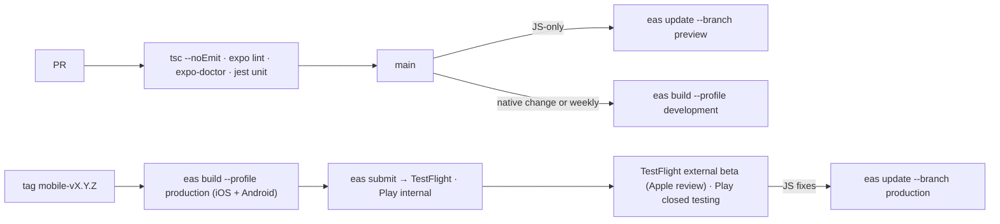

# Glance — mobile build and release

How the Expo app goes from "runs in Expo Go against a tunnel" to signed builds on
TestFlight and Google Play, with over-the-air updates for JavaScript changes.
Follows [`mobile/AGENTS.md`](../mobile/AGENTS.md): Expo Router for navigation, EAS for
build/submit/update, `npx expo install` for dependencies, lint + typecheck before done.

Related: [architecture.md](architecture.md) §7 · [infrastructure.md](infrastructure.md) §3 ·
[security.md](security.md) §5–6 · store assets in [`design/app-store/`](../design/app-store/1290x2796)

## 1. Today

| Item | State |
|---|---|
| SDK | Expo SDK 57, React Native 0.86, React 19, TypeScript 6 |
| Structure | One state machine in `App.tsx` (`home · ask · results · quote · approve · paid · limit`), `src/api.ts`, `src/Approve.tsx` (+ `.web.tsx`), `src/theme.ts`, `src/api.demo.ts` |
| Native modules | `react-native-webview`, `expo-image-picker`, `@react-native-community/slider`, `expo-linking` — all bundled in Expo Go, so no dev build was needed |
| Config | `app.json`: name Glance, slug `glance`, scheme `glance`, light UI, camera/photo permission strings, iOS tablet support |
| Environments | `EXPO_PUBLIC_API_URL` (backend), `EXPO_PUBLIC_DEMO=1` (offline canned adapter) |
| Run | `npx expo start --ios`, `npm run demo:ios` |

## 2. Target structure

```text
mobile/
├── app.config.ts            per-env name, bundle id, scheme, icon, EAS projectId, Sentry
├── eas.json                 build profiles + channels + env
├── src/
│   ├── app/                 Expo Router routes (one per screen)
│   │   ├── _layout.tsx      providers: auth session, API client, theme
│   │   ├── index.tsx        Home
│   │   ├── ask.tsx · results.tsx · quote.tsx · approve.tsx · paid.tsx · limit.tsx
│   │   ├── sign-in.tsx · address.tsx · cards.tsx · account.tsx   (beta)
│   │   └── done.tsx         universal-link / deep-link landing → status read
│   ├── components/          Btn, Radio, Meter, OrderRow, …
│   ├── api/                 client (fetch + auth header), types, demo adapter
│   ├── auth/                Supabase client, session hook
│   └── theme.ts
└── maestro/                 smoke flows (demo mode)
```

Non-route code stays outside `src/app/`. Each current screen becomes a route file with the
same copy and styles; the money formatter (`cents`, `money`) moves to `src/api/money.ts`
and keeps the integer-cents rule.

## 3. Build profiles and channels

| Profile (`eas.json`) | Distribution | Channel / runtime | API | Bundle id |
|---|---|---|---|---|
| `development` | internal, `expo-dev-client` | `development` | `https://api-dev.<domain>` | `com.glance.app.dev` |
| `preview` | internal (TestFlight internal, Play internal testing) | `preview` | `https://api-staging.<domain>` | `com.glance.app.preview` |
| `production` | store (TestFlight external beta → App Store; Play closed → open testing) | `production` | `https://api.<domain>` | `com.glance.app` |

- Environment per profile via `env` in `eas.json` (`EXPO_PUBLIC_API_URL`,
  `EXPO_PUBLIC_SUPABASE_URL`, `EXPO_PUBLIC_SUPABASE_ANON_KEY`, `EXPO_PUBLIC_SENTRY_DSN`).
  Nothing secret is allowed in `EXPO_PUBLIC_*` ([security.md](security.md) §5).
- `runtimeVersion: { policy: "appVersion" }` — an OTA update only reaches builds with the
  same native app version, so a JS update can never meet a native module it does not have.
- Credentials (Apple distribution certificate, provisioning profiles, Android keystore)
  are managed by EAS; nobody keeps them on a laptop.

## 4. Pipeline



- Builds run on EAS from the tag in CI (GitHub Actions with an `EXPO_TOKEN`), never from a
  developer machine for `production`.
- A native change is anything that touches `app.config.ts`, native dependencies or SDK
  version; it requires a new build and a new store submission. Everything else ships as
  an EAS Update to the matching channel, after the same checks.
- Rollback: `eas update` republish of the previous group for JS; for native, promote the
  previous TestFlight build / halt the Play rollout.
- Source maps upload to Sentry during the EAS build.

## 5. Store readiness

| Item | Status / plan |
|---|---|
| App record | App Store Connect app `Glance`, bundle `com.glance.app`; Play Console app, package `com.glance.app` |
| Icons & splash | `mobile/assets/` (icon, Android adaptive icon set, favicon) — review at 1024 px before submission |
| Screenshots | Eight 1290×2796 panels in `design/app-store/1290x2796/`, generated from `design/glance-app-store.html`; Apple accepts this size for the 6.7" and 6.9" slots. Android needs a 1080×1920+ set and a feature graphic — regenerate from the same artboards |
| Permissions | Camera and photo library strings already set in `app.json`; microphone disabled |
| Sign in | Sign in with Apple is mandatory once Google sign-in is offered ([security.md](security.md) §4) |
| Account deletion | In-app path (Account → Delete) backed by `DELETE /api/account` — required by both stores |
| Privacy | Privacy policy URL; App Store privacy labels and Play Data safety form consistent with [security.md](security.md) §9 |
| Review notes | Explain the flow, that approval happens on Reap's hosted page, and provide a sandbox test account with a stored test card so reviewers can complete a purchase without a real charge |
| Purchases of physical goods | Outside In-App Purchase by design (App Store guideline 3.1.3(e)); state it in the review notes |
| Age rating | 4+/Everyone; restricted categories excluded by the backend |

## 6. Quality gates

| Gate | Where | Tool |
|---|---|---|
| Types and lint | every PR | `npx tsc --noEmit`, `npx expo lint`, `npx expo-doctor` |
| Unit | every PR | Jest for `money.ts`, API client error mapping, limit meter maths |
| Smoke E2E | every PR, iOS simulator, demo mode | Maestro flow: Home → Ask (type) → Results → Quote → Approve (simulated page) → Paid; and the S$80 blocked path |
| Device matrix | before each TestFlight external build | iPhone SE (small), iPhone 15/16 Pro, one Android mid-range (Pixel 7a class); dark mode off (light UI only); Dynamic Type at 120 % |
| Crash-free | continuous | Sentry; beta target ≥ 99.5 % crash-free sessions |
| Accessibility | before beta | VoiceOver pass on all seven screens; `accessibilityRole="button"` already on `Btn`; focus order on Quote |

## 7. Return URL handling on device

The hosted approval page ends on `PUBLIC_URL/done`, which redirects to `glance://done`.
Beta adds **universal links / app links** so `https://api.<domain>/done` opens the app
directly on iOS and Android (associated domains file served by the API). Either way the
app only reads `GET /api/checkout/:id` — arrival is never treated as payment
([security.md](security.md) §6).

## 8. Demo mode stays

`EXPO_PUBLIC_DEMO=1` remains a first-class build flag: it is how the Maestro smoke test
runs without a backend, how store reviewers can be given a deterministic walk-through if
needed, and how the pitch video was recorded when the sandbox was down.
