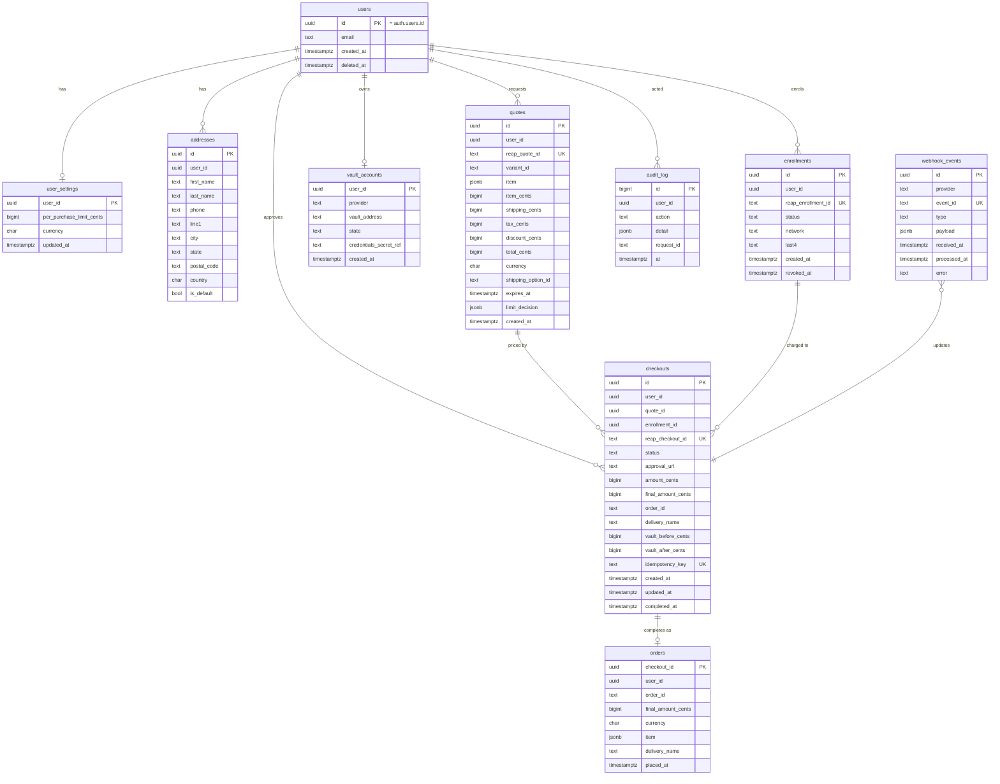
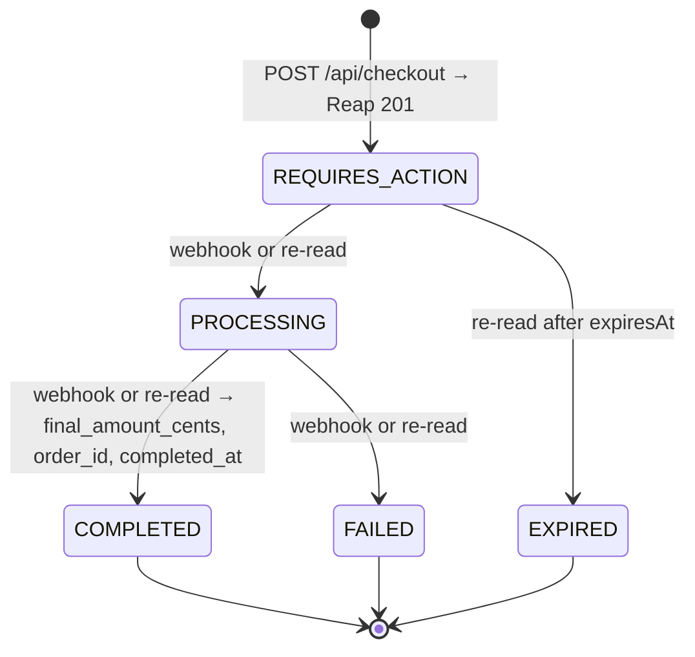

# Glance — data and persistence

How session state moves from the hackathon's JSON file to a per-user Postgres schema on
Supabase, and the rules the data has to obey. Shapes on the wire are unchanged and are
documented in [api.md](api.md) and
[`specs/001-agent-purchase/data-model.md`](../specs/001-agent-purchase/data-model.md).

Related: [architecture.md](architecture.md) §9 · [infrastructure.md](infrastructure.md) §7 ·
[security.md](security.md) §4

## 1. Today: one JSON file

`backend/app/main.py` keeps a dict in memory and writes it to `STATE_FILE`
(`/tmp/glance-state.json`):

```json
{ "limitCents": 15000, "orders": [], "quotes": { "<quoteId>": { "variantId": "...", "totalCents": 8446 } },
  "checkouts": { "<checkoutId>": { "quoteId": "...", "item": {...}, "deliveryName": "...", "totalCents": 8446, "balanceBeforeCents": 25000 } },
  "enrollmentId": "enr_..." }
```

Fine for one shopper on one laptop; wrong for a beta: no users, no concurrency safety,
lost on redeploy, and the Reap-side truth (checkout status) is only re-read when the app
asks.

## 2. Target schema

Postgres on Supabase, owned by Alembic migrations. Conventions: `uuid` primary keys,
`timestamptz` everywhere, money as `bigint` cents with a `char(3)` currency, Reap ids
stored verbatim and unique, every user-scoped table carries `user_id` for RLS.



### DDL sketch (the migration will be the source of truth)

```sql
create table users (
  id uuid primary key,                      -- Supabase auth.users.id
  email text not null,
  created_at timestamptz not null default now(),
  deleted_at timestamptz
);

create table user_settings (
  user_id uuid primary key references users(id) on delete cascade,
  per_purchase_limit_cents bigint not null default 15000 check (per_purchase_limit_cents > 0),
  currency char(3) not null default 'SGD',
  updated_at timestamptz not null default now()
);

create table enrollments (
  id uuid primary key default gen_random_uuid(),
  user_id uuid not null references users(id) on delete cascade,
  reap_enrollment_id text not null unique,
  status text not null check (status in ('REQUIRES_ACTION','ACTIVE','REVOKED','FAILED','EXPIRED')),
  network text, last4 char(4),
  created_at timestamptz not null default now(),
  revoked_at timestamptz
);
create unique index one_active_enrollment_per_user on enrollments(user_id) where status = 'ACTIVE';

create table quotes (
  id uuid primary key default gen_random_uuid(),
  user_id uuid not null references users(id) on delete cascade,
  reap_quote_id text not null unique,
  variant_id text not null,
  item jsonb,                               -- { name, merchant, imageUrl } for display only
  item_cents bigint check (item_cents >= 0), shipping_cents bigint check (shipping_cents >= 0),
  tax_cents bigint check (tax_cents >= 0), discount_cents bigint not null default 0 check (discount_cents >= 0),
  total_cents bigint not null check (total_cents >= 0),
  currency char(3) not null,
  shipping_option_id text,
  expires_at timestamptz,
  limit_decision jsonb not null,            -- LimitDecision at quote time, for the audit trail
  created_at timestamptz not null default now()
);

create table checkouts (
  id uuid primary key default gen_random_uuid(),
  user_id uuid not null references users(id) on delete cascade,
  quote_id uuid not null references quotes(id),
  enrollment_id uuid not null references enrollments(id),
  reap_checkout_id text unique,
  status text not null check (status in ('REQUIRES_ACTION','PROCESSING','COMPLETED','FAILED','EXPIRED')),
  approval_url text,
  amount_cents bigint not null check (amount_cents >= 0),       -- quote total at creation
  final_amount_cents bigint check (final_amount_cents >= 0),    -- what Reap actually charged
  order_id text,
  delivery_name text,
  vault_before_cents bigint, vault_after_cents bigint,
  idempotency_key text not null unique,     -- sent to Reap; retries reuse it
  created_at timestamptz not null default now(),
  updated_at timestamptz not null default now(),
  completed_at timestamptz
);
create index checkouts_open on checkouts(status) where status in ('REQUIRES_ACTION','PROCESSING');

create table audit_log (
  id bigint generated always as identity primary key,
  user_id uuid references users(id) on delete set null,
  action text not null,                     -- limit.changed · quote.blocked · checkout.created · checkout.completed · enrollment.revoked · account.deleted
  detail jsonb not null default '{}',
  request_id text,
  at timestamptz not null default now()
);

create table webhook_events (
  id uuid primary key default gen_random_uuid(),
  provider text not null default 'reap',
  event_id text not null unique,            -- idempotent intake
  type text not null,
  payload jsonb not null,
  received_at timestamptz not null default now(),
  processed_at timestamptz,
  error text
);
```

`orders` is a view over `checkouts where status = 'COMPLETED'` in the first migration; it
becomes a table only if order data starts to diverge from checkouts (returns, tracking).

### What is deliberately not stored

- **Card data.** Never. `last4` and `network` come from Reap's enrollment object and are
  display only.
- **Photos.** The image goes from the phone to the model via the API in one request and
  is not written anywhere. Only `parser` and `fromPhoto` flags are kept on the audit row.
- **Model transcripts.** The reply is reduced to `{ query, maxPriceCents }`; the raw
  text is discarded.
- **Vault credentials.** `vault_accounts.credentials_secret_ref` points at a Secrets
  Manager entry; the credential itself never enters Postgres.

## 3. Row-level security

Supabase Auth gives every request a JWT whose `sub` is `users.id`. The API connects with
the service role and is the only writer, so RLS is defence in depth rather than the primary
control — it protects against a leaked anon key or a future direct-from-app read.

```sql
alter table user_settings enable row level security;
create policy own_settings on user_settings using (user_id = auth.uid());
-- same pattern on addresses, enrollments, vault_accounts, quotes, checkouts, orders (view: security_invoker), audit_log
alter table webhook_events enable row level security;   -- no user policy: service role only
```

## 4. Checkout state and reconciliation

The database mirrors Reap's lifecycle and never gets ahead of it.



Rules:

1. **Only Reap data moves a row forward.** A status transition is written from a Reap
   response or a verified webhook payload, never from the app ("I landed on `/done`").
2. **Transitions are monotonic.** `update ... where status in (<earlier states>)` so a
   late poll cannot regress a `COMPLETED` row; final states are never overwritten.
3. **`final_amount_cents` is set once, from `finalAmount`.** The Paid screen and the
   `orders` view read only this column.
4. **Reconciliation job** (every 5 min, [infrastructure.md](infrastructure.md) §4): select
   `checkouts_open` rows, call `GET /agentic/checkouts/:id`, apply rule 2. Rows older than
   24 h still non-final raise an alarm with the `reap_checkout_id` for Reap support.
5. **Webhook intake** writes `webhook_events` first (unique `event_id` makes redelivery a
   no-op), then applies the transition, then stamps `processed_at`. Verification is in
   [security.md](security.md) §7.
6. **Vault after** is read when the row reaches `COMPLETED`, not at the moment the app
   asks, so the receipt is consistent on every device.

## 5. Migrations

- Alembic under `backend/migrations/`, SQLAlchemy 2 models under `backend/app/db/`.
- `alembic upgrade head` runs in CI against `staging` and `prod` *before* the ECS deploy
  of the matching image; migrations must be backwards compatible with the previous image
  (expand → migrate → contract across two releases) because the rolling deploy keeps old
  tasks alive for a while.
- Forward-only in prod. A bad migration is fixed by a new migration, not a downgrade.
- The first migration also carries a one-off import of the hackathon `STATE_FILE`, so
  the demo orders can be replayed into a test user on `dev`.

## 6. Retention and deletion

| Data | Keep | Then |
|---|---|---|
| `quotes` | 30 days after `expires_at` | Delete (they are re-priced anyway) |
| `checkouts` / `orders` | Life of the account | Required for receipts and disputes |
| `audit_log` | 12 months | Archive to S3 (Parquet) then delete |
| `webhook_events` | 90 days | Delete |
| ALB access logs, CloudWatch logs | 30 days | Expire |
| Account deletion (`DELETE /api/account`, an App Store requirement) | — | Revoke the Reap enrollment, set `users.deleted_at`, cascade-delete user rows, keep an anonymised `audit_log` line with the counts |

## 7. Capacity

Beta volume is small: a few hundred users, tens of purchases a day. One Supabase Pro
instance with the default compute is ample; the only index that matters early is
`checkouts_open` for the reconciliation job. Revisit when `checkouts` passes ~1 M rows.
