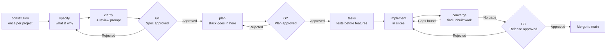

# Glance: SDD run sheet (how we build)

We build with Spec-Driven Development using GitHub Spec Kit and three human
gates per spec. Read docs/context.md for the product and API facts, and
docs/scope-lock.md for what is in and out today. The scope lock wins.

## Workflow per spec

```
specify -> clarify -> G1 -> plan -> G2 -> tasks -> implement -> converge -> G3
```



## Rules of this run sheet
- Execute top to bottom. Setup and constitution run once.
- STOP and report after the spec: what was built, test results,
  traceability status, open findings.
- STOP at every gate and wait for a named human to approve. Gates are never
  approved retroactively.
- The spec contains no "how". No technology names in spec.md; the stack
  goes in plan.md.
- Never re-run `specify init` on this repo; it overwrites files.
- Sandbox only. No real money, no real purchases.

## Commands (Devin form)
| Step | Command | Output |
|---|---|---|
| Constitution | /speckit-constitution | .specify/memory/constitution.md, once |
| Specify | /speckit-specify | new 001-* branch + specs/001-*/spec.md |
| Clarify | /speckit-clarify + review prompt below | ambiguities resolved in spec.md |
| G1 | human | specs/001-*/gates/G1.md committed |
| Plan | /speckit-plan | plan.md, data model, contracts |
| G2 | human | gates/G2.md committed |
| Tasks | /speckit-tasks | tasks.md, tests and pure logic first |
| Implement | /speckit-implement | code + tests, one slice per commit |
| Converge | /speckit-converge | unbuilt work appended as tasks; loop until clean |
| G3 | human | gates/G3.md committed |

If /speckit-converge is not installed, use /speckit-analyze and list any
acceptance criterion without a passing test.

## Gate criteria (today's short form)
| Gate | Question | Pass evidence |
|---|---|---|
| G1 Spec | Is the problem understood? | Clarify done; every requirement has Given/When/Then acceptance criteria; no technology names in spec.md |
| G2 Plan | Is the solution sound? | Plan respects the constitution; the limit check is a pure, tested function; secrets are env vars only |
| G3 Release | Did we build what we specified? | scripts/happy_path.sh passes; one purchase completes in the app on a phone; every AC has a named test or a noted manual check |

## Gate record template (specs/<spec>/gates/G1.md, G2.md, G3.md)

```markdown
# G<n> - <Specification | Plan | Release> approval

Spec: specs/<spec>/spec.md
Approved by: <name>
Date: <date>
Decision: Approved / Approved with conditions / Rejected

Conditions:
-

Open questions carried forward:
-
```

## Step 1: constitution (run once)

The constitution block is in docs/constitution-prompt.md.

## Standard clarify review prompt (paste after /speckit-clarify)

```
Review the specification and identify:
- Missing requirements
- Ambiguous wording
- Business assumptions stated as fact
- Missing validation rules
- Edge cases
- Missing error handling
- Missing non-functional requirements
- Missing acceptance criteria

Review every functional requirement. Suggest improvements. Update the
specification where necessary. Ensure every acceptance criterion has an
ID of the form AC-<spec>-<nn> and exactly one level tag: [api], [ui], or
[e2e]. Prefer [api] wherever the rule can be proven without a screen.
Check every payment rule against the constitution, especially User
Approves Every Charge and Limit Before Checkout.

Where the payment provider's behaviour is unknown, mark it
[NEEDS CLARIFICATION] and list what to observe in the sandbox to resolve
it. Do not guess the provider's behaviour.

Do not generate implementation. Do not generate source code.
```

## Spec 001: agent purchase, end to end

```
/speckit-specify

A shopper tells an assistant in one sentence what to buy and the most
they will pay. The assistant turns that sentence into a product search
and a price ceiling, finds matching products from supported merchants,
and shows up to three, with the best match preselected.

For the chosen product the assistant obtains the merchant's full price
including shipping and tax, and the available shipping options. Changing
the shipping option re-prices the order. The shopper sees the itemised
total and how it compares with their per-purchase limit.

Before any payment is started, the total is compared with the limit. If
the total is over the limit, payment is unavailable and the shopper is
told the amount over. The shopper can change the limit; the new limit
applies to the next quote.

When the total is within the limit, the shopper is sent to the payment
provider's approval page. The app does not recreate this page. After the
shopper approves, they see the order reference, the amount actually
charged, and their delivery choice. If they decline, nothing is charged
and they are told so.

The home screen shows the shopper's stablecoin vault balance, the last
four digits of the card it backs, the limit, and orders made in this
session. With no orders it explains how to make the first one.

Failures from the merchant or payment provider are reported in plain
language and are never retried silently. The visual reference is
design/glance-app-mockup.html.
```
